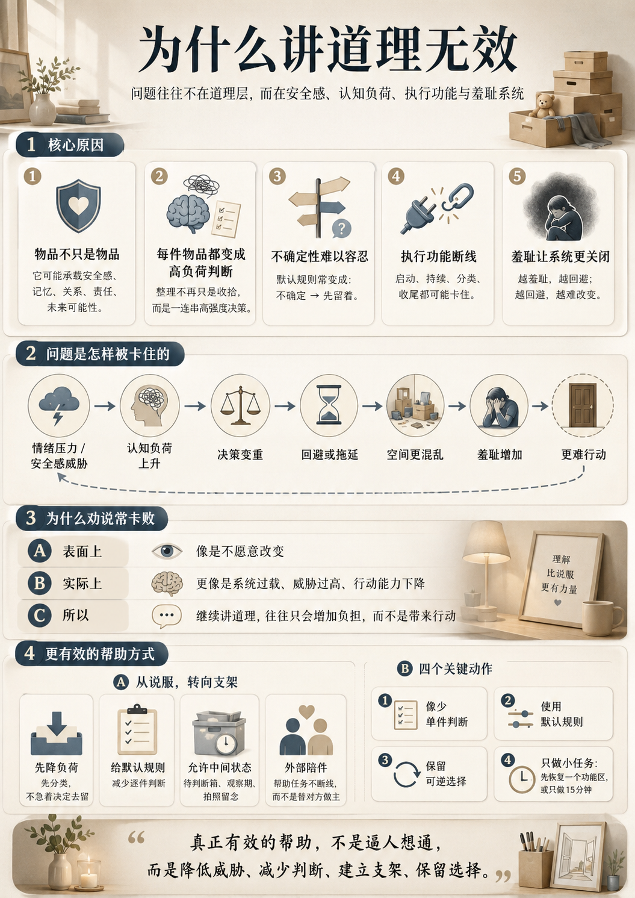

# 第 4 讲：为什么讲道理无效

## 1. 本讲目标

这一讲解释一个常见挫败：

```text
为什么明明道理很简单，对方就是不整理、不丢、不改变？
```

答案不是“他听不懂”，而是：

```text
你以为问题发生在道理层，
但它往往发生在情绪、认知负荷、执行功能和安全感系统层。
```



学完本讲，学员应能：

1. 理解劝说为什么经常失败。
2. 掌握囤积和空间防御背后的认知负荷链。
3. 区分价值说服、情绪安抚和认知支架。
4. 学会把“讲道理”替换成“降负荷、给支架、做小实验”。

## 2. 讲道理无效的第一原因：物品不是物品

当一个物品只是物品时，判断很简单：

```text
有没有用？
要不要留？
放在哪里？
```

但当物品承载安全、记忆、责任、关系和未来选项时，它就不再是普通物品。

丢弃可能被体验为：

- 丢掉未来可能性。
- 背叛过去。
- 否定某段关系。
- 放弃安全储备。
- 承认自己曾经浪费。
- 承担不可逆后悔。

所以一句“这又没用”会失败，因为对方听到的可能是：

```text
你的记忆没用。
你的安全感没用。
你的担心没用。
你这个人太荒唐。
```

## 3. 第二原因：每件物品都变成高负荷判断

普通整理依赖类别判断：

```text
同类集中
常用留下
重复减少
低频集中
无用退出
```

但囤积困扰中，经常进入逐件审判：

```text
这个什么时候买的？
以后会不会用到？
是不是某个人送的？
如果丢了后悔怎么办？
能不能修？
别人会不会需要？
是不是浪费？
```

结果是：

```text
整理不再是体力活，
而变成一连串高强度决策任务。
```

这时讲道理只会增加判断负担。

## 4. 第三原因：不确定性无法被容忍

很多囤积判断的默认规则是：

```text
不确定 → 先留着
```

这不是完全没逻辑。因为“保留”在短期看最安全：

| 选择 | 短期体验 |
|---|---|
| 丢掉 | 可能后悔、焦虑、内疚 |
| 留着 | 立刻避免损失感 |

所以保留会被不断强化。

真正要改变的不是说服对方“它没用”，而是降低不确定性的威胁。

## 5. 第四原因：执行功能断线

整理是一串复杂任务：

```text
看见物品
→ 判断类别
→ 回忆用途
→ 比较价值
→ 决定去留
→ 放到对应位置
→ 继续下一个
```

如果有抑郁、ADHD、焦虑、疲惫或长期压力，这条链很容易断。

表现为：

- 开始不了。
- 开始后被细节带走。
- 越整理越乱。
- 每个物品都要想很久。
- 无法收尾。
- 一想到整理就崩溃。

这时“你赶紧收拾一下”没有用，因为问题不是不知道该收拾，而是启动系统和收尾系统都失灵了。

## 6. 第五原因：羞耻会让系统更关闭

羞辱式语言包括：

- 你怎么这么懒。
- 这都是垃圾。
- 正常人谁这样。
- 你就不能狠心一点吗。
- 我帮你全扔了算了。

这些话会造成三种后果：

```text
羞耻上升
→ 回避上升
→ 更不敢面对空间
```

如果对方本来就处在抑郁、创伤或不安全关系中，羞耻会进一步削弱行动能力。

## 7. 替代策略：从讲道理到给支架

不要先说服，先降负荷。

| 无效做法 | 更好做法 |
|---|---|
| 这个没用，扔了 | 我们先按类别放一起，不马上决定 |
| 你别想那么多 | 先设一个待判断箱，7 天后再看 |
| 你太乱了 | 我们先恢复床/门口/卫生间一个功能 |
| 你就是舍不得 | 这个物品保留的是功能、记忆还是安全感 |
| 我替你扔 | 哪些东西你允许我帮你移动到临时区 |

## 8. 认知支架的四个原则

## 8.1 减少单件判断

不要一件一件问：

```text
这个要不要？
那个要不要？
```

改成类别规则：

```text
所有过期食品直接退出。
重复物品保留状态最好的 2 个。
包装盒最多保留一个箱子。
```

## 8.2 使用默认规则

在高负荷状态下，不要让每个决定都重新发明规则。

示例：

```text
一年没用且可低成本再买 → 退出。
坏了一年没修 → 退出。
没有明确用途的包装 → 进入观察箱。
```

## 8.3 允许可逆中间状态

直接丢弃威胁太高，可以先：

- 临时箱。
- 待判断区。
- 7 天观察。
- 拍照留念。
- 象征物保留。

## 8.4 外部陪伴维持任务轨道

陪伴者的作用不是替他扔，而是帮助任务不断线：

```text
我们现在只处理这一类。
我们先不决定纪念品。
我们今天只做 15 分钟。
你不用解释每一个物品。
```

## 9. 课堂练习：把劝说改成支架

把下面的话改写：

| 原句 | 改写 |
|---|---|
| 这些都是垃圾 |  |
| 你怎么什么都舍不得 |  |
| 你再不整理就完了 |  |
| 我帮你全扔了 |  |
| 这有什么好纠结的 |  |

参考方向：

```text
先确认功能，再降低任务，再给可逆选择。
```

## 10. 课后作业

找一个你一直卡住的整理任务，写出：

```text
1. 它到底卡在启动、分类、判断、丢弃还是收尾？
2. 我能不能把它从“全屋整理”缩小成一个 15 分钟任务？
3. 我能不能先设一个待判断箱，而不是立刻丢？
4. 我能不能给这类物品设置一个数量上限？
```

## 11. 本讲总结

```text
讲道理无效，不是因为人不讲理。
而是因为问题发生在安全感、认知负荷、执行功能和羞耻系统里。
真正有效的帮助，是降低威胁、减少判断、建立支架、保留选择。
```


